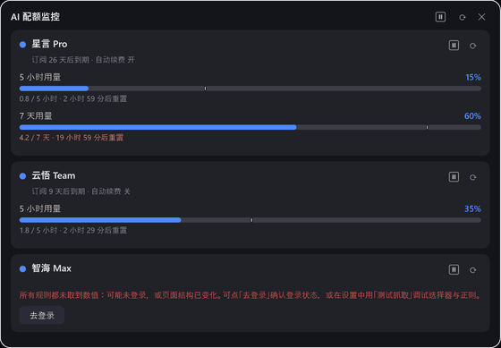
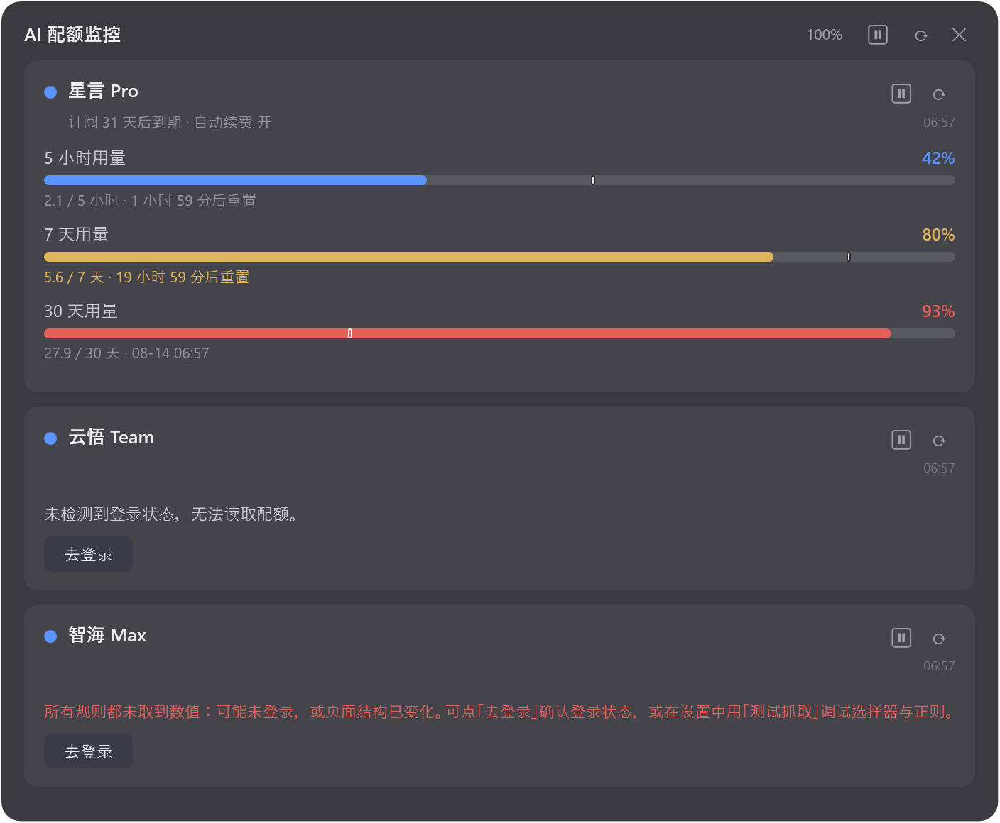
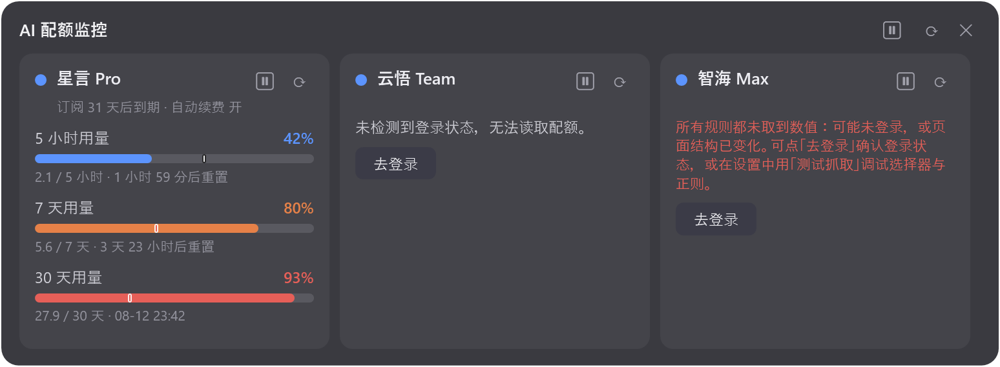

# AIQuotaMonitor

[](https://github.com/henry-jia/AIQuotaMonitor/actions/workflows/build.yml)
[](LICENSE)
[](https://github.com/henry-jia/AIQuotaMonitor/releases)

**[中文文档](README.md) | English**

AIQuotaMonitor is a Windows 11 desktop widget that shows quota usage for multiple AI subscriptions (5-hour / 7-day / 30-day windows) in one borderless, translucent, always-on-top panel.

Most AI vendors expose **no quota API**, so the app works differently: give each service a URL, and it periodically opens that page in an embedded WebView2 (using your existing local login) and extracts the numbers with rules you configure in the settings UI. Rules default to **label-anchored auto-location** — the label just needs to match the text shown on the page (e.g. "Weekly usage limit"), no CSS knowledge required. Everything is configured through the GUI; no files to hand-edit.







## Features

- Borderless rounded dark translucent widget; drag anywhere to move (position persisted); always-on-top toggle; adjustable opacity; **customizable background color** (picker with screen eyedropper; under Win11 glass it acts as the tint, alpha controls how much the blur shows through); **mouse-wheel zoom for the whole UI incl. text, with a 100% reset button** in the title bar
- **Native Windows 11 look**: the widget uses DWM **Acrylic** blur and the settings/history/color-picker windows use **Mica**, dark and immersive with system-aligned 8px rounded corners; icon buttons use **Segoe Fluent Icons** (refresh/pause/close/warning) with layered hover/pressed feedback; on Windows 10 it gracefully falls back to solid rounded surfaces
- One card per service: accent dot + name (**Ctrl+Click opens the official usage page in your browser**; names show link style while Ctrl is held) + last-refresh time (small text right of the subscription line; `HH:mm` today, `MM-dd HH:mm` older). Each quota window is one row: label + percentage + slim progress bar + usage detail / reset time
- **Alt+Drag to reorder cards**: a free-floating ghost follows your cursor (even outside the window) while siblings slide aside with smooth 150ms animations; the new order is persisted
- **Global color themes**: bars are colored by 4 semantic states — **Normal** (theme color), **Near baseline** (within 10pp of the time baseline; or ≥60% when no baseline), **Ahead of baseline** (burning faster than time), **Critical** (≥90%, highest priority). 5 built-in presets (Azure / Emerald / Violet / Sunset / Graphite) plus full **custom** per-state colors via a color picker dialog (with screen eyedropper) — see "Color themes" below
- **Time-pace baseline**: a tick on each bar marks where usage *should* be if you consumed evenly (50% at half of a 5-hour window, 57% on day 4 of a 7-day window). White tick with dark edge = on/under pace (healthy); red core with white edge = ahead of pace (ration it). Window length is inferred from the rule label (`5 hour`→5h, `7 day`/`week`→7d, `month`→30d; fallback: nearest bucket from remaining time). Global toggle in settings
- Tiered **reset countdown warnings**: short windows (≤24h, e.g. 5h) turn yellow at ≤1h and orange-red at ≤30min; long windows (7d/30d) yellow at ≤24h and orange-red at ≤2h; **subscription expiry** yellow at ≤5 days, orange-red at ≤1 day
- Vertical / horizontal layouts; window auto-sizes to content
- Scheduled auto-refresh (default 5 min, global or per-service), sequential in background, never blocks the UI; **page-load timeout is configurable** (global settings, default 30s — raise it for slow-rendering sites)
- Title-bar ⟳ force-refreshes all; **each card has its own ⟳** for just that service; clicks always queue (never silently dropped), with a "refreshing…" indicator
- **Pause scraping**: title-bar ⏸ pauses globally (also in right-click/tray menu), per-card ⏸ pauses one service — paused services are **never contacted** (useful during risk-control-sensitive periods), while countdowns and the baseline tick keep updating locally every minute; resume triggers an immediate catch-up scrape
- Right-click menu + system tray: refresh / pause / always-on-top / layout / language / settings / show-hide / exit; double-click tray icon to toggle
- Error states: "sign in required" card with a **Sign in** button (opens an embedded browser to log in once, auto re-scrapes on close); scrape failures show the reason with full details in tooltip
- **Stale-data fallback**: when a refresh fails (timeout, navigation failure, …) but a previous scrape succeeded, the card **keeps showing the previous data** with a small amber line "⚠ Refresh failed — showing data from HH:mm" (hover for the full error); after a restart it immediately shows the previous session's data with the same marker until the first successful refresh replaces it. "Sign in required" still gets its dedicated card, so a needed re-login is never hidden
- **Usage history**: each successful refresh records one percentage sample per quota row (local-only `history.jsonl`, 30-day retention, >7-day samples decimated to hourly). **Click a quota row** to open the history window: 24h / 7d / 30d trend chart (reset sawtooth drawn as segments) + now / Δ-in-range / pace / **projection of % at reset based on the last-24h pace**, with **CSV export**. Recording can be turned off in global settings
- **Quota threshold reminder**: a tray balloon fires once at the moment any usage crosses the threshold upward (default 90%, adjustable)
- **Launch at Windows startup** (optional in global settings, per-user Run registry entry); a saved window position that lands outside all screens is clamped back / centered
- Shared WebView2 user-data folder (`%LOCALAPPDATA%\AIQuotaMonitor\WebView2UserData`) — **one login per domain**; cookies (incl. session cookies) are exported after each scrape, DPAPI-encrypted, and restored on startup so logins survive restarts
- **English / 中文 UI** (follows system by default, quick-switch via right-click menu)

## Quick start

1. Download `AIQuotaMonitor.exe` from [Releases](https://github.com/henry-jia/AIQuotaMonitor/releases) (single self-contained exe, no .NET runtime needed; requires WebView2 Runtime, which ships with Windows 11). Once the winget package is approved: `winget install henry-jia.AIQuotaMonitor`.
2. Run it. A `config.json` (with a disabled sample service) is created next to the exe on first launch.
3. Right-click the widget → **Settings…**, edit the sample service or click **Add** to create your own.

> Put the exe in a stable folder (e.g. `D:\Tools\AIQuotaMonitor\`) — config is saved beside it.

## Adding a service (worked example)

Say your AI service has a usage page at `https://console.example.com/usage` showing "Used 42% this period" and "12 / 50 calls · resets in 3 days".

1. **Sign in**: after saving the service, the card shows "sign in required" — click **Sign in** and log in once in the embedded browser (the session is shared afterwards).
2. **Service fields**:
   - Name: `Example AI`
   - URL: `https://console.example.com/usage`
   - Extra wait (sec): `10` — this is a **timeout cap**, not a fixed wait: the app polls every 0.5s and starts scraping as soon as your anchor text appears (often ~1s); slow SPAs get up to the cap
   - Logged-out selector: optional; if the page always shows a login button when signed out (e.g. `.login-btn`), a hit means "need login"
3. **Rules** (leave CSS selector empty):
   - Rule 1: label `5-hour usage`, type `Percent`, preset regex → `(\d+(?:\.\d+)?)\s*%`
   - Rule 2: label `Monthly usage`, type `Fraction (a/b)`, preset regex → `(\d+)\s*/\s*(\d+)`. Reset time needs no config — `Resets in…` / `重置时间：…` etc. are auto-recognized
4. **Debug**: select the service, click **Test scrape**. You'll see each rule's raw captured text and parsed result — if the label misses, match the page text exactly; if the number is wrong, adjust the regex against the raw text.
5. Saving applies immediately; **only new or changed services re-scrape** — untouched services keep their data and schedule (use ⟳ to force-refresh everything).

**How auto-location works**: the app finds the element showing your label text (e.g. the "Weekly usage limit" heading), climbs up to the container holding the number (usually that quota's card), applies the regex there, and recognizes reset text in the same area (`Resets in…`, `重置时间：…`, `…后重置`, `将于…重置`). Search covers the main document, all same-origin iframes, and open shadow roots; if nothing is found, the content may live in a **cross-origin iframe** (JS can't read it — Aliyun console does this), in which case the app automatically collects those iframe URLs and navigates straight into them to scrape again. The label is the anchor, so **it must match the page text exactly**.

**Multilingual pages**: some sites render differently per browser language ("5 小时用量" in your browser, "5-hour usage" in the embedded one — the embedded browser is set to zh-CN). Fill **Match text** with aliases separated by `|`, e.g. `5 小时用量|5-hour usage` — any hit counts (the label stays as-is for display).

**When you do need a CSS selector** (advanced): if the same label text appears in multiple regions, or the label and value aren't in the same container, pin the scope with a CSS selector (F12 → right-click element → Copy selector). A filled selector switches the rule to "selector mode": the regex only matches inside that element.

## Rule fields

| Field | Meaning |
| --- | --- |
| Label | Display name on the card, e.g. "5-hour usage". **In auto-location mode it's also the default anchor** — must match page text |
| Match text | Optional. Empty = use label; multilingual pages: aliases separated by `\|` (e.g. `5 小时用量\|5-hour usage`), any hit counts |
| Type | `Percent`: page shows xx% directly; `Fraction (a/b)`: page shows a / b, percentage is computed with "a / b" as the detail |
| CSS selector | **Empty (recommended)** = auto-location by label text; filled = selector mode, regex only matches inside that element |
| Regex | First capture group is the value; percent preset `(\d+(?:\.\d+)?)\s*%`, fraction preset `(\d+)\s*/\s*(\d+)` (two groups) |
| Value is remaining % | Optional. When the page shows "remaining" instead of "used" (e.g. `73% remaining` → shows 27% used), percent type only |
| Reset selector | Optional, selector mode only. Selector for reset-time text; empty = whole page |
| Reset regex | Optional. In auto-location mode, empty = auto-recognize `重置时间：…` / `…后重置` / `Resets in …`; custom: first capture group is the display text, case-insensitive |

Service-level fields: name, URL, extra wait seconds, logged-out selector (optional), refresh interval (optional, falls back to global), subscription URL (optional).

## Color themes (global settings)

All cards share one **global palette**: 4 semantic state colors + 1 accent:

| Swatch | Meaning |
| --- | --- |
| Accent | Service dot on each card |
| Normal | Usage comfortably behind the time baseline (<60% when no baseline) |
| Near baseline | Within 10 percentage points of the baseline (≥60% when no baseline) |
| Ahead of baseline | Burning faster than time |
| Critical (90%) | Usage ≥90%, highest priority |

The **Color theme** dropdown at the top of Global settings offers 5 presets (Azure / Emerald / Violet / Sunset / Graphite) with live preview on the five swatches below.

Choose **Custom** to make the swatches clickable: each opens a **color picker dialog** (large preview, `#RRGGBB` input, R/G/B sliders). The dialog's **Pick from screen** button freezes the screen and shows a 7×7-pixel loupe with the current hex — **left-click to pick, Esc or right-click to cancel**.

Stored in `config.json` under `theme` (`name` = preset key or `"custom"`, plus five hex values when custom). Configs without `theme` default to Azure; the legacy per-service `color` field is ignored on load and no longer written.

## Reset time: parsing & display (global settings)

Captured reset text is parsed into an **absolute timestamp** at scrape time (so relative values like "resets in 2 hours" never drift). Recognized formats include `重置时间：16:33`, `2026-07-26 10:00`, `07-23 14:44 后重置`, `2026-08-17 后重置`, `将于 2026年7月29日 1:04 重置`, `Resets in 07-23 14:44`, `Resets Jul 29, 2026 1:04 AM` (English month names), `3 天后重置`, `3天9小时29分钟后重置`, and more; unparseable text is shown as-is.

Global toggles:

- **Unify reset date format** (default on): vendors use wildly different formats; enable to render them uniformly. Presets (`MM-dd HH:mm`, `yyyy-MM-dd HH:mm`, `MM月dd日 HH:mm`, `HH:mm`) or any custom .NET format string.
- **Show time until reset** (default on): near the reset shows a countdown ("resets in 2d 3h"); beyond the **threshold** (default 7 days, editable) it shows the absolute date instead. **Tiered warnings** (recolors every minute without scraping): short windows (≤24h) yellow at ≤1h / orange-red at ≤30min; long windows yellow at ≤24h / orange-red at ≤2h; subscription expiry yellow at ≤5 days / orange-red at ≤1 day. Colors come from the theme's semantic colors and follow the selected theme.

## Login flow

1. With a logged-out selector configured: a hit → card shows "sign in required" + Sign in button.
2. Without one: all rules failing → "scrape failed (maybe signed out or page changed)" with the same Sign in button.
3. Sign in opens the embedded browser (shared session); after logging in, **just close the window** — the service re-scrapes automatically. When a service flips from OK to sign-in-required, a tray balloon lets you know.

## Subscription expiry & auto-renew (zero-config smart scan)

During each scrape the app also scans the page text (incl. same-origin iframes and shadow roots) and shows the result under the service name, e.g. "Expires in 31 days · Auto-renew on":

- **Expiry** is recognized from `结束时间 2026-08-24`, `剩余天数 31 天`, `下次自动续费时间：2026-08-17`, `08月03日自动续费`, `will be canceled on Aug 19, 2026`, etc.; **yellow at ≤5 days, orange-red at ≤1 day**
- **Auto-renew** from `自动续费 开启/未开启` text, implicit signals like `下次自动续费时间`, and the actual state of switch/checkbox controls
- If the info lives on a **different page** (e.g. Zhipu's plan overview, Codex's Billing page), fill the service's **Subscription URL**; these are fetched on a 6-hour cache so refreshes don't open an extra page every time. Empty = scan the usage page itself, free.

## Usage history & stale-data fallback

Both files live in `%LOCALAPPDATA%\AIQuotaMonitor\`, stay on this machine, and are never uploaded:

| File | Content |
| --- | --- |
| `lastgood.json` | Last successful scrape result per service (fallback source when a refresh fails or after a restart) |
| `history.jsonl` | Usage-percentage time series, one JSON per line, e.g. `{"t":"2026-08-05T22:55:01+08:00","svc":"<id>","rule":"5-hour usage","pct":42,"detail":"2.1 / 5 hours","resetAt":"…"}` |

- History is kept for **30 days**; samples older than 7 days are decimated to one per hour.
- Clicking a quota row on a card opens the history window (24h / 7d / 30d). Stats: current value, Δ in range (accumulated since the last reset), recent pace (%/h), and a projection "≈ X% at reset" at the last-24h pace.
- **Record usage history** can be turned off in global settings (turning off keeps existing data; delete the file to clear).
- Series are keyed by each rule's stable id, so **renaming a label keeps its history** (samples from before v1.3.0 fall back to label matching).

## Lessons learned (scrape engineering notes)

Pitfalls hit while adapting five vendors — useful context when adding new services:

1. **The hidden scrape window needs a real viewport** (1280x800). A 1x1 transparent window makes lazy-render SPAs (Aliyun console) skip content rendering entirely — the login window looks fine but JS finds nothing.
2. **Cross-origin iframes: visible ≠ readable.** Same-origin policy blocks JS from reading them. The app collects unreadable iframe URLs and navigates straight into them (top-level navigation has no such limit).
3. **Session cookies vs persistent cookies.** Aliyun's login ticket is session-scoped — Chromium keeps it in memory only, gone on process exit (your daily browser never notices because its process lives for weeks). The app exports all cookies after each scrape, DPAPI-encrypts them to disk, and restores on startup. Server-side session expiry still requires re-login, nothing can fix that client-side.
4. **The embedded browser's language changes page text.** Setting WebView2 to zh-CN flipped Kimi/Codex pages from English to Chinese, breaking English anchors — hence `zh|en` aliases in Match text.
5. **Polling beats fixed waits.** SPA render time is unpredictable; the app polls every 0.5s with "extra wait seconds" as a timeout cap.
6. **Skeleton renders before data — a match isn't proof of data.** Aliyun's progress-bar axis labels (0% 50% 90% 100%) render before real values and were once scraped as 0%. Fix: among multiple matches, pick the element with the **largest font size** (real values are always big), and the wait-poll requires "extraction succeeded with quality (single match or big-font match)".
7. **Navigation failure ≠ page didn't load.** Aliyun's redirect chain makes WebView2 report failure while the page loaded fine — always check actual page content.
8. **Errors must carry the scene.** A bare "scrape failed" is undebuggable; failures now include each rule's specific reason + page title + first 300 chars of body text, so you can tell at a glance whether it's a login wall, a wrong label, or a changed layout.
9. **Regex `\b` doesn't work on CJK.** CJK characters are all word characters, so there's no boundary between 时 and 用 in 小时用量 — put `\b` only on the English branches (`天|days?\b`). Hit twice, in relative-time parsing and window-length inference.

## FAQ

**Q: "WebView2 Runtime missing" on startup?**
The app needs the WebView2 Evergreen Runtime (ships with Windows 11). Follow the prompt to install it from Microsoft: https://developer.microsoft.com/en-us/microsoft-edge/webview2/ , then restart the app. Check the version via the `pv` value under `HKLM\SOFTWARE\WOW6432Node\Microsoft\EdgeUpdate\Clients` ("Microsoft Edge WebView2 Runtime").

**Q: No data / "scrape failed"?**
Open Settings, select the service, click **Test scrape**:
- "Navigation failed": the error includes the final URL and title — if you were redirected to a login page, sign in first (redirect chains like Aliyun's are handled: content is checked before failing);
- "Anchor text not found": the label doesn't match the page text — make it exact (slow rendering is handled by polling; raise Extra wait seconds for very slow pages);
- Check the "raw text" — if it's a login page, sign in via the card's Sign in button;
- If numbers exist but parsing fails, adjust the regex so the first capture group is the value; if the page shows "remaining xx%", enable "Value is remaining percent";
- If the label appears in multiple regions and grabs the wrong one, pin a CSS selector (F12 → right-click → Copy selector).

**Q: How long does the login last?**
Sessions live in `%LOCALAPPDATA%\AIQuotaMonitor\WebView2UserData`, one login per domain. Cookies (incl. session cookies like Aliyun's) are exported after each scrape, DPAPI-encrypted to `%LOCALAPPDATA%\AIQuotaMonitor\cookies.dat`, and restored on startup — so logins survive restarts. Note: server-side session expiry still requires re-login (a tray balloon tells you).

**Q: Does one failing service affect others?**
No. Services scrape independently with independent schedules; a failure only shows on its own card.

## Building

Requires .NET SDK 10:

```powershell
# Build
dotnet build app/AIQuotaMonitor.csproj -c Release

# Publish: self-contained single-file exe
dotnet publish app/AIQuotaMonitor.csproj -c Release -r win-x64 --self-contained true `
  -p:PublishSingleFile=true -p:IncludeNativeLibrariesForSelfExtract=true -o publish/
```

Output: `publish/AIQuotaMonitor.exe`, fully portable.

## UI language

The UI supports **简体中文** and **English** (settings panel, context menus, tray, card states, login window, balloons, error messages):

- Default **follows system**: Chinese UI if your system language is Chinese, English otherwise.
- **Quick switch**: right-click or tray menu → 语言 / Language → Follow system / 中文 / English — applies instantly and persists to `language` in `config.json` (`"auto"` / `"zh"` / `"en"`).
- The same dropdown exists under Global settings.

## Test screenshot modes

Renders the main window with built-in sample data — seven cards covering every state: OK (three quotas covering normal/ahead/critical colors), need-login, failed (Sign in), stale fallback, stale + login-suggested, failed (View page), and paused + expired subscription — without initializing WebView2:

```powershell
AIQuotaMonitor.exe --test-shot out.png                          # vertical
AIQuotaMonitor.exe --test-shot out.png --layout horizontal      # horizontal
AIQuotaMonitor.exe --test-shot out.png --lang en                # UI language (zh/en)
AIQuotaMonitor.exe --test-settings-shot settings.png            # settings window (both tabs)
AIQuotaMonitor.exe --test-history-shot out.png                  # usage history window (synthetic samples)
AIQuotaMonitor.exe --test-frames frames_dir                     # frame series for demo GIFs
```

## Config storage

`config.json` lives **next to the exe** (`System.Text.Json`, camelCase): services & rules (each service carries a stable `id` used to correlate history), window position, always-on-top, opacity, layout, theme, language, refresh intervals, pause states. No hand-editing needed — dragging the window, toggling options, and reordering cards all save automatically.

## Project structure

```
app/
  AIQuotaMonitor.csproj   net10.0-windows, WPF + WindowsForms, Microsoft.Web.WebView2
  App.xaml(.cs)           entry, CLI args (--test-shot …), global dark styles
  Models.cs               AppConfig / ServiceConfig / QuotaRule / result models
  ConfigStore.cs          config.json IO (camelCase, defaults, JSON deep clone)
  I18n.cs                 UI i18n (zh/en tables, follow-system resolution, Changed event)
  ColorTheme.cs           global color themes (5 presets + custom resolution)
  ScrapeEngine.cs         hidden host window + shared WebView2: navigate → poll → JS extract
  CookieStore.cs          cookie export/restore (DPAPI-encrypted)
  PaceBaseline.cs         time-pace baseline (window inference, elapsed ratio)
  ResetTimeParser.cs      reset-text parsing & tiered display formatting
  GhostWindow.cs          drag ghost (floating borderless window for reorder UX)
  MainWindow.xaml(.cs)    widget window, timers, tray, context menu, drag reorder
  ServiceCard.xaml(.cs)   service card (OK / need-login / error states)
  SettingsWindow.xaml(.cs) settings UI (services/rules, presets, test scrape, global, themes)
  ColorPickerDialog.xaml(.cs) color picker (hex/RGB sliders + screen eyedropper)
  LoginWindow.xaml(.cs)   embedded-browser login window
  HistoryStore.cs         usage-history samples history.jsonl (append / decimate / query)
  LastGoodStore.cs        last successful results lastgood.json (stale fallback source)
  HistoryWindow.xaml(.cs) usage history window (hand-drawn trend chart + stats)
  TestShot.cs             --test-shot / --test-settings-shot / --test-frames modes
```

## Disclaimer & compliance

- This tool is for **checking your own accounts' usage**: it opens vendor pages with your local login, parses and displays locally, and never stores or uploads login credentials. For display continuity and the trend chart it additionally keeps the last successful scrape result and usage-percentage history on this machine (`lastgood.json` / `history.jsonl`, opt-out in settings, delete the files to clear); all data stays on this machine. Respect each vendor's terms of service; don't use it for bulk scraping, automation abuse, or anything against the target sites' rules.
- Vendor names and trademarks belong to their owners; this project is not affiliated with or endorsed by them.
- Third-party component licenses: .NET runtime (MIT, bundled self-contained), Microsoft.Web.WebView2 ([WebView2 Runtime license](https://learn.microsoft.com/microsoft-edge/webview2/), redistributable), System.Security.Cryptography.ProtectedData (MIT).
- Released under the MIT License (see [LICENSE](LICENSE)), provided "as is", without warranty of any kind.
